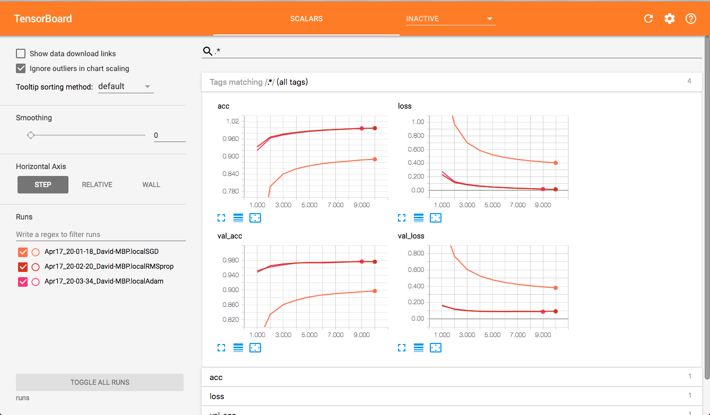

# torchtools: A High-Level training API on top of PyTorch

[](https://travis-ci.org/Time1ess/torchtools)
[](https://github.com/Time1ess/torchtools/blob/master/LICENSE)
[](https://Time1ess.github.io/torchtools)

---

torchtools is a High-Level training API on top of [PyTorch](http://pytorch.org) with many useful features to simplifiy the traing process for users.

It was developed based on ideas from [tnt](https://github.com/pytorch/tnt), [Keras](https://github.com/fchollet/keras). I wrote this tool just want to release myself, since many different training tasks share same training routine(define dataset, retrieve a batch of samples, forward propagation, backward propagation, ...).

This API provides these follows:

* A high-level training class named `ModelTrainer`. No need to repeat yourself.
* A bunch of useful `callbacks` to inject your code in any stages during the training.
* A set of `meters` to get the performance of your model.
* Visualization in TensorBoard support(TensorBoard required).

## Requirements

* tqdm
* Numpy
* [PyTorch](http://pytorch.org)
* [tensorboardX](https://github.com/lanpa/tensorboard-pytorch)
* [Standalone TensorBoard](https://github.com/dmlc/tensorboard)(Optional)

## Installation

torchtools has been tested on **Python 2.7+**, **Python 3.5+**.

`pip install torchtools`

## Screenshots

Training Process:


Visualization in TensorBoard:




## 1 Minute torchtools MNIST example

```Python
import torch.nn as nn
import torch.optim as optim
import torch.nn.functional as F
import torchvision.transforms as T

from torch.utils.data import DataLoader
from torch.nn.init import xavier_uniform as xavier
from torchvision.datasets import MNIST

from torchtools.trainer import Trainer
from torchtools.meters import LossMeter, AccuracyMeter
from torchtools.callbacks import (
    StepLR, ReduceLROnPlateau, TensorBoardLogger, CSVLogger)


EPOCHS = 10
BATCH_SIZE = 32
DATASET_DIRECTORY = 'dataset'

trainset = MNIST(root=DATASET_DIRECTORY, transform=T.ToTensor())
testset = MNIST(root=DATASET_DIRECTORY, train=False, transform=T.ToTensor())

train_loader = DataLoader(trainset, batch_size=BATCH_SIZE, shuffle=True)
test_loader = DataLoader(testset, batch_size=BATCH_SIZE)


class Net(nn.Module):
    def __init__(self):
        super().__init__()
        self.fc1 = nn.Linear(28 * 28, 100)
        self.fc2 = nn.Linear(100, 10)

        for m in self.modules():
            if isinstance(m, nn.Linear):
                xavier(m.weight.data)

    def forward(self, x):
        x = x.view(-1, 28 * 28)
        x = F.relu(self.fc1(x))
        x = self.fc2(x)
        return x


model = Net()
optimizer = optim.SGD(model.parameters(), lr=1e-3, momentum=0.9)
criterion = nn.CrossEntropyLoss()

trainer = Trainer(model, train_loader, criterion, optimizer, test_loader)

# Callbacks
loss = LossMeter('loss')
val_loss = LossMeter('val_loss')
acc = AccuracyMeter('acc')
val_acc = AccuracyMeter('val_acc')
scheduler = StepLR(optimizer, 1, gamma=0.95)
reduce_lr = ReduceLROnPlateau(optimizer, 'val_loss', factor=0.3, patience=3)
logger = TensorBoardLogger()
csv_logger = CSVLogger(keys=['epochs', 'loss', 'acc', 'val_loss', 'val_acc'])

trainer.register_hooks([
    loss, val_loss, acc, val_acc, scheduler, reduce_lr, logger, csv_logger])

trainer.train(EPOCHS)
```

### Callbacks

`callbacks` provides samilar API compared with [Keras](https://github.com/fchollet/keras). We can have more control on our training process through `callbacks`.

```Python
from torchtools.callbacks import StepLR, ReduceLROnPlateau, TensorBoardLogger

scheduler = StepLR(optimizer, 1, gamma=0.95)
reduce_lr = ReduceLROnPlateau(optimizer, 'val_loss', factor=0.3, patience=3)
logger = TensorBoardLogger(comment=name)

...

trainer.register_hooks([scheduler, reduce_lr, logger])
```

### Meters

`meters` are provided to measure `loss`, `accuracy`, `time` in different ways.

```Python
from torchtools.meters import LossMeter, AccuracyMeter

loss_meter = LossMeter('loss')
val_loss_meter = LossMeter('val_loss'))
acc_meter = AccuracyMeter('acc')
```

### Put together

Now, we can put it together.

1. Instantiate a `Trainer` object with `Model`, `Dataloader for trainset`, `Criterion`, `Optimizer`, and other optional arguments.
2. All `callbacks` and `meters` are actually `Hook` objects, so we can use `register_hooks` to register these hooks to `ModelTrainer`.
3. Call `.train(epochs)` on `Trainer` with training epochs.
4. Done!

## Contributing

Please feel free to add more features!

If there are any bugs or feature requests please [submit an issue](https://github.com/Time1ess/torchtools/issues/new), I'll see what I can do.

Any new features or bug fixes please submit a PR in [Pull requests](https://github.com/Time1ess/torchtools/pulls).

If there are any other problems, please email: <a href="mailto:youche.du@gmail.com">youchen.du@gmail.com</a>

## Acknowledgement

Thanks to these people and groups:

* All PyTorch developers
* All PyTorchNet developers
* All Keras developers
